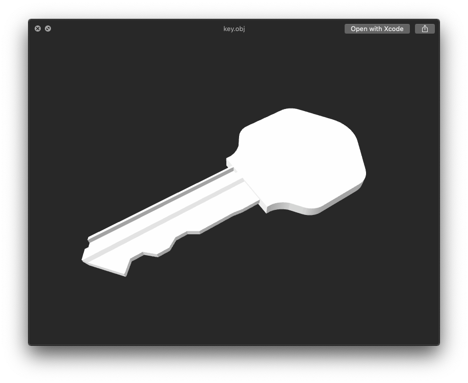
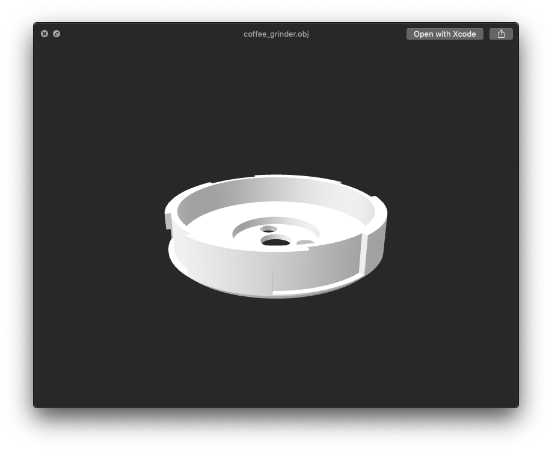

# [SketchUp](https://www.sketchup.com)

_SketchUp_ is 3D modeling tool for architectecture and printing.

## House Key - [`key/`](key/)
Model of our house key to test the precision of 3D printing technology for key duplication.
 

## Coffee Grinder Base - [`coffee_grinder/`](coffee_grinder/)
Model of a replacement part of KitchenAid Coffee Grinder. The original was very fragile injection mold part that didn't handle the vibrations very well and cracked little after a year of usage.

