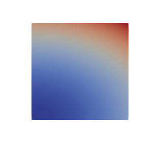
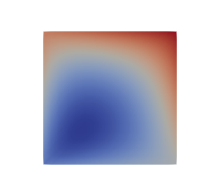
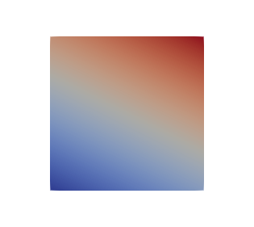

# [FEniCS](https://fenicsproject.org/)

FEniCS is open-source computing platform for solving partial differential equations (PDEs). It enables users to
quickly translate scientific models into efficient finite element code thanks to it's  high-level Python and C++
interface. FEniCS can run on a multitude of platforms ranging from laptops to high-performance clusters.


## Poisson PDE - [`poisson/`](poisson/)
- [`poisson.html`](https://rawgit.com/vojtamolda/concepts/master/fenics/poisson/poisson.html)
  and [`poisson.py`](poisson/poisson.py) - Poisson equation boundary problem on a unit square.
  ```math
  div(grad(u)) = 6                 # in the unit square
             u = 1 + x**2 + 2y**2  # on the boundary (and analytically)
  ```
  

- [`non_linear.html`](https://rawgit.com/vojtamolda/concepts/master/fenics/poisson/non_linear.html)
  and [`coeffs.py`](poisson/coeffs.py) - Non constant coefficients Poisson equation boundary problem on a unit square.
  ```math
  div((x + y) * grad(u)) = 8x + 10y         # in the unit square
                       u = 1 + x**2 + 2y**2  # on the boundary (and analytically)
  ```
  

- [`non_linear.html`](https://rawgit.com/vojtamolda/concepts/master/fenics/poisson/non_linear.html)
  and [`non_linear.py`](poisson/non_linear.py) - Non-linear Poisson equation boundary problem on a unit square.
  ```math
  div((1 + u**2) * grad(u)) = 10x + 20y + 10   # in the unit square
                          u = 1 + x**2 + 2y**2  # on the boundary (and analytically)
  ```
  


### Requirements
- [FEniCS](http://fenicsproject.org/) - Collection of software components for solving PDEs.
- [ParaView](http://paraview.org/) - Multi-platform data analysis and visualization application.
