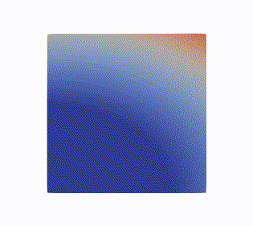
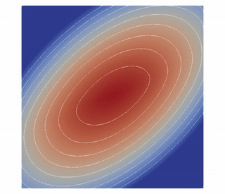
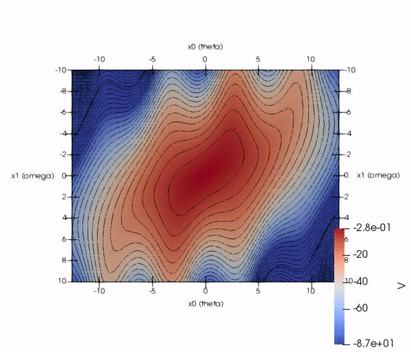

# [FEniCS](https://fenicsproject.org/)

FEniCS is open-source computing platform for solving partial differential equations (PDEs). It enables users to
quickly translate scientific models into efficient finite element code thanks to it's  high-level Python and C++
interface. FEniCS can run on a multitude of platforms ranging from laptops to high-performance clusters.


## Poisson PDE - [`poisson/`](poisson/)
- [`poisson.html`](https://rawgit.com/vojtamolda/concepts/master/fenics/poisson/poisson.html)
  and [`poisson.py`](poisson/poisson.py) - Poisson equation boundary problem on a unit square.
  ```math
  div(grad(u)) = 6                 # in the unit square
             u = 1 + x**2 + 2y**2  # on the boundary (and analytically)
  ```
  

- [`non_linear.html`](https://rawgit.com/vojtamolda/concepts/master/fenics/poisson/non_linear.html)
  and [`coeffs.py`](poisson/coeffs.py) - Non constant coefficients Poisson equation boundary problem on a unit square.
  ```math
  div((x + y) * grad(u)) = 8x + 10y          # in the unit square
                       u = 1 + x**2 + 2y**2  # on the boundary (and analytically)
  ```
  

- [`non_linear.html`](https://rawgit.com/vojtamolda/concepts/master/fenics/poisson/non_linear.html)
  and [`non_linear.py`](poisson/non_linear.py) - Non-linear Poisson equation boundary problem on a unit square.
  ```math
  div((1 + u**2) * grad(u)) = 10x + 20y + 10    # in the unit square
                          u = 1 + x**2 + 2y**2  # on the boundary (and analytically)
  ```
  


## Heat Transfer PDE - [`heat/`](heat/)
- [`heat.py`](heat/heat.py) - Solve evolution of temperature field `T` over time on a unit square.
- [`heat0.html`](https://rawgit.com/vojtamolda/concepts/master/fenics/heat/heat0.html) - First time-step.
- [`heat1.html`](https://rawgit.com/vojtamolda/concepts/master/fenics/heat/heat1.html) - Last time-step.
  ```math
   T' = div(grad(T)) - 5       # in the unit square
    T = 1 + x**2 + 2*y**2 + t  # on the boundary (and analytically
    T = 1 + x**2 + 2*y**2      # initially at t = 0
  ```
  


## Hamilton-Jacobi-Bellman PDE - [`hjb/`](hjb/)

### HJB PDE for Slider
- [`slider.py`](hjb/slider.py) - HJB equation for value function `V` solved for a mass controlled by force `u`.
- [`slider.html`](https://rawgit.com/vojtamolda/concepts/master/fenics/hjb/slider.html) - First time-step.
- [`theory.pdf`](https://rawgit.com/vojtamolda/concepts/master/fenics/hjb/theory.pdf) - Explanation.
  ```math
  r = -(x0**2 + x1**2 + u**2)/2  # u - control from <-1,+1>, x0 - position, x1 - speed
  f = [u, x0]          # system dynamics (i.e. = [dx0_dt, dx1_dt])

  - V' = min(grad(V)*f + r) = 0  # HJB equation
  - V' = - abs(dV_dx0) + dV_dx1*x0 - (x0**2 + x1**2 + 1)/2  # analytical minimization
       gradV = 0                 # on the boundary
           V = 0                 # initially at t = 0
  ```
  


### HJB for Pendulum
- [`pendulum.py`](hjb/pendulum.py) - HJB equation for value function `V` solved for a pendulum controlled by torque `u`.
- [`pendulum.html`](https://rawgit.com/vojtamolda/concepts/master/fenics/hjb/pendulum.html) - First time-step.
- [`theory.pdf`](https://rawgit.com/vojtamolda/concepts/master/fenics/hjb/theory.pdf) - Explanation.
  ```math
  r = -(x0**2 + x1**2 + u**2)/2  # u - control from <-1,+1>, x0 - angle, x1 - angular velocity
  f = [sin(x1) + u, x0]          # system dynamics (i.e. = [dx0_dt, dx1_dt])
  
  - V' = min(grad(V)*f + r) = 0  # HJB equation
  - V' = dV_dx0*sin(x1) - abs(dV_dx0) + dV_dx1*x0 - (x0**2 + x1**2 + 1)/2  # analytical minimization
       gradV = 0                 # on the boundary
           V = 0                 # initially at t = 0
  ```
  


### Requirements
- [FEniCS](http://fenicsproject.org/) - Collection of software components for solving PDEs.
- [ParaView](http://paraview.org/) - Multi-platform data analysis and visualization application.
