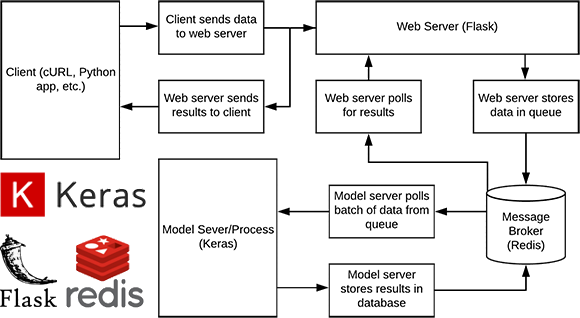

# [Keras](https://keras.io)

Keras is a high-level neural networks API, written in Python and capable of running on top of TensorFlow, CNTK, or
Theano. It was developed with a focus on enabling fast experimentation.


## Scalable REST Model Server  - [`server/`](server/)

Simple Keras REST API server which leverages Redis along with message queueing/brokering to efficiently batch process
incoming classification requests and dispatch them for processing by a separate worker server equipped with a GPU.



- There's a small unit test `TestClassificationServer.test_high_load(...)` which shows that a single GPU machine can
  easily handle ~500 parallel requests (with 0.05 s delay). The performance continues to scale when more classifier
  GPU machines is added.
- See [`requirements.txt`](server/requirements.txt) file for a complete list. Here are the key components:
  - [Apache](https://httpd.apache.org/) - HTTP Server (with `libapache2-mod-wsgi-py3` Plugin)
  - [Flask](http://flask.pocoo.org/) - Python Web-Server Framework
  - [Redis](https://redis.io/) - In Memory Key-Value Database


```bash
#/bin/bash
sudo service apache2 start
redis-server
./classifier.py
curl -X POST -F image=@image.png 'http://localhost/predict'
```
