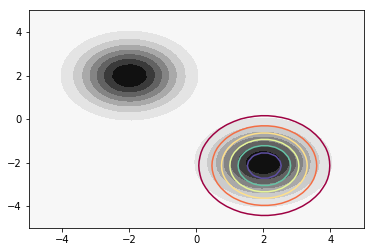
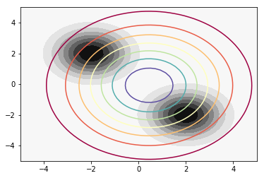
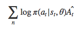

# [PyTorch](http://pytorch.org)

PyTorch is a deep learning framework that puts Python first. Tensors and Dynamic neural networks in Python with strong
GPU acceleration. We are in an early-release Beta. Expect some adventures.

## Basics - [`basics/`](basics/)
- [`tensors.ipynb`](basics/tensors.ipynb) - Understand PyTorch’s tensors and how to create them from Numpy arrays.
- [`autograd.ipynb`](basics/autograd.ipynb) - Automatic differentiation of tensor calculation graphs.

## Cross-Entropy Reinforcement Learning Method - [`cem/`](cem/)
- [`cem.ipynb`](cem/cem.ipynb) - Cross-entropy optimization method implemeted as `pytorch.optim.Optimizer`.
- [`cem.pdf`](cem/cem.pdf) - Explanation

## Distributions - [`distributions/`](distributions/)
- [`kl_divergence.ipynb`](distributions/kl_divergence.ipynb) - Minimize KL divergence KL(p,q) and KL(q,p) betwen two multi-variate Gaussian distributions.
- [`kl_divergence.pdf`](distributions/kl_divergence.pdf) - Explanation and theoretical derivation of the optimization algorithm.

## Deep Q-Network Reinforcement Learning Algorithm - [`dqn/`](dqn/)
- [`dqn.ipynb`](dqn/dqn.ipynb) - DQN agent trained on the `CartPole` environment with experience replay.

## Neural Networks - [`neural_network/`](neural_network/)
- [`neural_network.ipynb`](neural_network/neural_network.ipynb) - Neural Network module and example network with cost function.
- [`cifar10.ipynb`](neural_network/cifar10.ipynb) - Train a small neural network to classify CIFAR10 dataset images.

## Policy Gradients Reinforcement Learning Method - [`pg/`](pg/)
- [`pg.ipynb`](pg/pg.ipynb) - Vanilla policy gradient algorithm with advantage.
- [`pg.pdf`](pg/pg.pdf) - Explanation

### Requirements
- [Jupyter](http://jupyter.org/) - Application to create documents with contain code, equations, visualizations and text.
- [PyTorch](http://pytorch.org/) - Tensor manipulation framework with automatic differentiation.
- [Open AI Gym](http://gym.openai.com/) - Toolkit for developing and comparing reinforcement learning algorithms.
